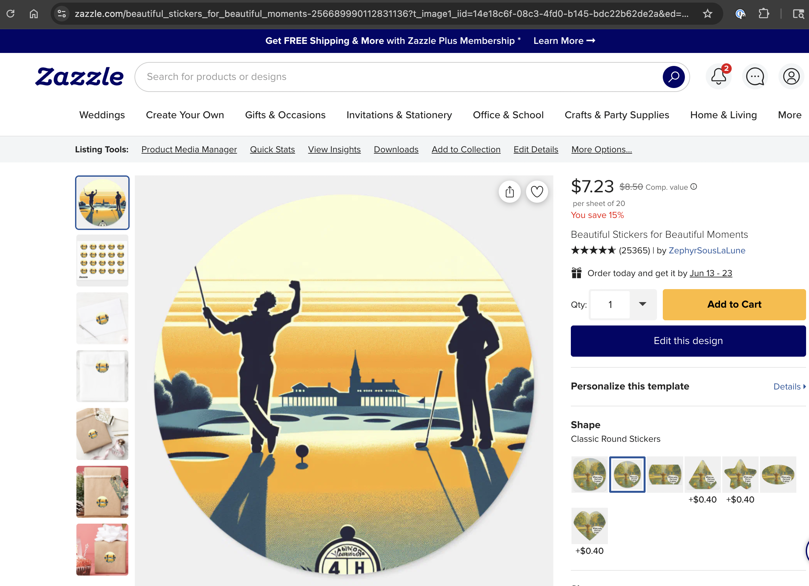
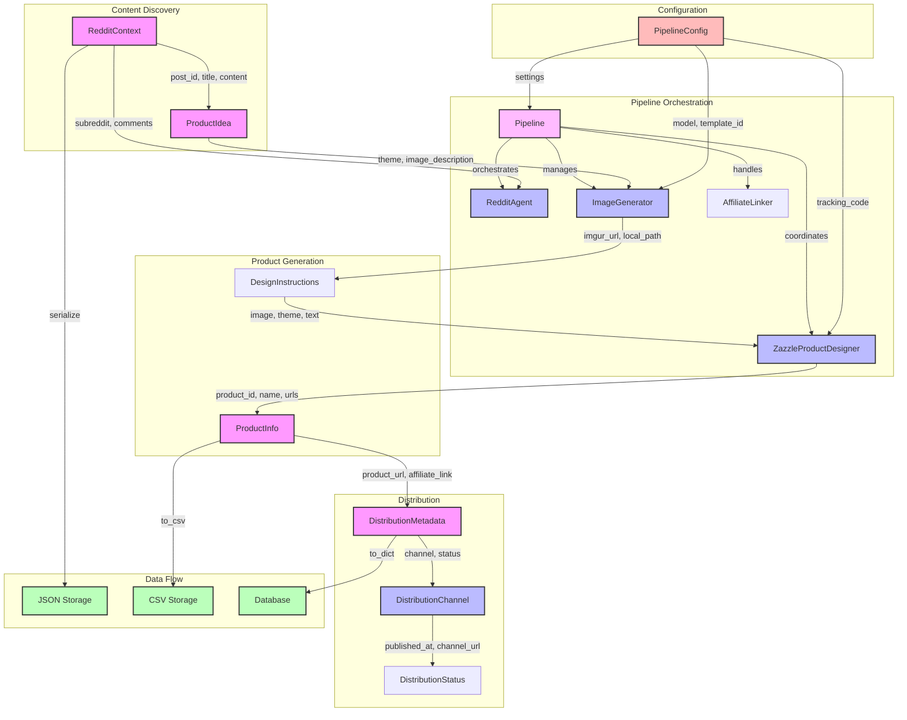

# Zazzle Dynamic Product Generator

## Project Summary

This project automates the creation of Zazzle products based on trending Reddit posts. It features a robust pipeline that:
- Discovers and analyzes trending posts and comments from the r/golf subreddit
- Summarizes Reddit content and generates product ideas using GPT-4
- Produces unique product images with DALL-E 3
- Creates and lists products on Zazzle, including affiliate links
- Maintains traceability from Reddit context to final product
- Handles errors, retries, and logging throughout the process

The system is fully automated and has been tested end-to-end, successfully generating real Zazzle products from live Reddit content.

## End-to-End Progress Milestone

### Project Summary (2024-06-10)

- The pipeline was successfully run end-to-end, generating a Zazzle product from a trending Reddit post in r/golf.
- The system now prefers text posts, summarizes top comments, and validates the theme and context for product generation.
- The generated product includes a DALL-E 3 image, Reddit context, and a Zazzle affiliate link, all fully automated.
- The README now includes a real product showcase with a screenshot, product details, and Reddit context for traceability.

### Project Summary (2024-06-11)

- Enhanced database layer with strategic indexes for improved query performance
- Added comprehensive error logging throughout the pipeline
- Improved pipeline error handling with detailed context and stack traces
- Made command-line arguments more flexible with optional mode parameter
- Added database layer documentation to README

Below is a showcase of a real product generated by the pipeline, including all relevant context and design details:

### Product Screenshot



### Product Information
- **Product Name:** 'Golfing Underdog Triumph'
- **Product Type:** sticker
- **Theme:** 'Golfing Underdog Triumph'
- **Image URL:** https://i.imgur.com/yXvuwCg.png
- **Product URL:** https://www.zazzle.com/api/create/at-238627313417608652?ax=linkover&pd=256689990112831136&fwd=productpage&ed=true&t_image1_url=https%3A//i.imgur.com/yXvuwCg.png&tc=RedditStickerz_0
- **Affiliate Link:** https://www.zazzle.com/product/prod_209eae18?rf=test_affiliate_id
- **Template ID:** 256689990112831136
- **Model:** dall-e-3
- **Prompt Version:** 1.0.0

### Reddit Context
- **Post ID:** 1l8xbol
- **Title:** Riggs the 4hc…
- **URL:** https://reddit.com/r/golf/comments/1l8xbol/riggs_the_4hc/
- **Subreddit:** golf
- **Content:**
  > Riggs the so called 4hc got beat by a 15hc and 10hc. Being this was Oakmont from the Tips— this should have made the hc difference even greater. Statically, Riggs should have beat them both. It just amazes me he still claims a single digit HC… dude has the biggest vanity hc in golf history

### Comment Summary
> The Reddit comments discuss a person named Riggs, who seems to play golf and posts about his games. However, the commenters doubt the authenticity of his scores suggesting that he only reports his best games while hiding poor scores. Some also demand to see his performance in a $25k match, implying Riggs might avoid such a challenge.

### Design Description
> A simplified illustration of a golf field, the sun setting behind it. In the center, a triumphant golfer raises his club after hitting a winning shot, his small figure silhouette against the backdrop of the giant challenging Oakmont course. Behind him, a larger figure - representing the 'so called' 4hc golfer - stands dejectedly. Their golf club is faintly depicted as a 'vanity mirror', humorously alluding to the vanity hc in golf history.

## System Components

### 1. Pipeline
- Orchestrates the complete product generation process
- Manages concurrent operations and error handling
- Implements retry logic with exponential backoff
- Coordinates between all system components
- Provides a unified interface for end-to-end product generation

### 2. Reddit Agent
- Monitors and interacts with r/golf subreddit
- Uses LLM to analyze posts and comments for product opportunities
- Generates engaging and marketing-focused comments
- Makes voting decisions based on content relevance
- Operates in test mode for safe development

### 3. Product Designer
- Receives design instructions from Reddit Agent
- Uses DTOs (Data Transfer Objects) for product configuration
- Integrates with Zazzle Create-a-Product API
- Manages product creation and listing
- Handles URL encoding for product parameters

### 4. Integration Layer
- Coordinates between Reddit Agent and Product Designer
- Manages API authentication and rate limiting
- Handles error recovery and retry logic
- Maintains system state and logging

## Workflow Diagram



## Component Details

### Pipeline Orchestration
- **Pipeline**: Central orchestrator for the product generation process:
  - Manages the complete product generation workflow
  - Handles concurrent operations and error recovery
  - Implements retry logic with exponential backoff
  - Coordinates between all system components
  - Provides a unified interface for end-to-end product generation
  - Supports both single and batch product generation
  - Maintains comprehensive logging and error tracking

### Content Discovery
- **RedditContext**: Captures all relevant information from a Reddit post, including:
  - Post ID, title, and content
  - Subreddit information
  - Comments and engagement metrics
  - URL and metadata
- **ProductIdea**: Represents the initial concept for a product, containing:
  - Theme and image description
  - Design instructions
  - Source Reddit context
  - Model and prompt version information

### Product Generation
- **ImageGenerator**: Creates product images using DALL-E models:
  - Accepts theme and image descriptions
  - Generates images using specified DALL-E model
  - Stores images locally and on Imgur
  - Returns image URLs and local paths
- **DesignInstructions**: Contains all parameters needed for product creation:
  - Image URL and theme
  - Text and color specifications
  - Product type and quantity
  - Template and model information
- **ZazzleProductDesigner**: Creates products on Zazzle:
  - Uses design instructions to configure products
  - Integrates with Zazzle's Create-a-Product API
  - Generates affiliate links
  - Returns complete product information

### Distribution
- **DistributionMetadata**: Tracks content distribution:
  - Channel-specific information
  - Publication status and timestamps
  - Error handling and recovery
  - URL and ID tracking
- **DistributionChannel**: Manages content publishing:
  - Handles different distribution platforms
  - Manages rate limiting and quotas
  - Tracks engagement metrics
  - Handles error recovery
- **DistributionStatus**: Monitors distribution state:
  - Tracks pending, published, and failed states
  - Manages retry logic
  - Records timestamps and metadata

### Configuration
- **PipelineConfig**: Central configuration management:
  - AI model selection (DALL-E 2/3)
  - Zazzle template and tracking settings
  - Prompt versioning
  - System-wide parameters

### Data Flow
- **JSON Storage**: Stores Reddit context and metadata
- **CSV Storage**: Records product information and metrics
- **Database**: Maintains distribution status and history

### Database Layer
The system uses SQLAlchemy with PostgreSQL for persistent storage. The database schema includes:

1. **RedditContext**:
   - Stores Reddit post information (ID, title, content, URL)
   - Tracks subreddit and post metadata
   - Maintains timestamps for content discovery
   - Indexed fields: `post_id`, `subreddit`, `created_at`

2. **ProductInfo**:
   - Records product details (name, type, theme)
   - Stores image URLs and design information
   - Links to source Reddit context
   - Indexed fields: `product_id`, `theme`, `created_at`

3. **DistributionMetadata**:
   - Tracks distribution channels and status
   - Stores affiliate links and tracking codes
   - Records publication timestamps
   - Indexed fields: `channel`, `status`, `published_at`

4. **ErrorLog**:
   - Captures detailed error information
   - Stores stack traces and error context
   - Tracks retry attempts and recovery status
   - Indexed fields: `error_type`, `component`, `created_at`

The database layer provides:
- Efficient querying through strategic indexes
- Data integrity through foreign key relationships
- Comprehensive error tracking and logging
- Audit trail for all system operations

## Data Model Relationships

1. **Content to Product Flow**:
   ```
   RedditContext → ProductIdea → DesignInstructions → ProductInfo
   ```
   - Each step enriches the data with additional information
   - Maintains traceability back to source content
   - Preserves metadata throughout the pipeline

2. **Product to Distribution Flow**:
   ```
   ProductInfo → DistributionMetadata → DistributionStatus
   ```
   - Tracks product lifecycle
   - Manages distribution state
   - Records engagement metrics

3. **Configuration Flow**:
   ```
   PipelineConfig → (ImageGenerator, ZazzleProductDesigner)
   ```
   - Centralizes configuration
   - Ensures consistency across components
   - Manages versioning and updates

## Error Handling and Recovery

The system implements comprehensive error handling at each stage:

1. **Pipeline Orchestration**:
   - Manages concurrent operations safely
   - Implements retry logic with exponential backoff
   - Handles component failures gracefully
   - Maintains system state during errors

2. **Content Discovery**:
   - Validates Reddit API responses
   - Handles rate limiting
   - Manages API timeouts

3. **Product Generation**:
   - Retries failed image generation
   - Validates design instructions
   - Handles Zazzle API errors

4. **Distribution**:
   - Tracks failed distributions
   - Implements retry logic
   - Maintains error logs

## Monitoring and Logging

Each component includes detailed logging:
- Operation status and timing
- Error conditions and recovery
- Performance metrics
- Data flow tracking

## Features

- **Pipeline Orchestration**: Centralized management of the product generation process
- **Reddit Integration**: Automated monitoring and interaction with r/golf
- **LLM-Powered Analysis**: Dynamic product idea generation using OpenAI GPT
- **Product Generation**: Dynamic sticker design creation with configurable image generation models (DALL-E 2 and DALL-E 3)
- **Marketing Automation**: Context-aware comment generation
- **Test Mode**: Safe development environment with dry-run capabilities
- **Comprehensive Testing**: Unit, integration, and end-to-end test coverage with dedicated test output directory
- **DTO-Based Configuration**: Type-safe product configuration using Python DTOs

## Prerequisites

- Python 3.8+
- Zazzle API credentials
- Reddit API credentials
- OpenAI API key

## Environment Variables

Create a `.env` file in the project root with the following variables:

```
ZAZZLE_AFFILIATE_ID=your_zazzle_affiliate_id
REDDIT_CLIENT_ID=your_reddit_client_id
REDDIT_CLIENT_SECRET=your_reddit_client_secret
REDDIT_USERNAME=your_reddit_username
REDDIT_PASSWORD=your_reddit_password
OPENAI_API_KEY=your_openai_api_key
```

Note: The Zazzle template ID and tracking code are now managed through the `ZAZZLE_STICKER_TEMPLATE` configuration in `app/zazzle_templates.py`. This provides a centralized way to manage product templates and ensures consistency across the application.

## Development

This project uses a Makefile to simplify common development tasks:

```bash
make venv      # Create Python virtual environment
make install   # Install dependencies
make test      # Run test suite
make run       # Run the app locally
make run-full  # Run the complete end-to-end pipeline
make clean     # Clean up development artifacts
```

### Example Commands

Run the full pipeline with DALL-E 2 (default):
```bash
make run
```

Run the full pipeline with DALL-E 3:
```bash
make run MODEL=dall-e-3
```

Generate an image with a custom prompt using DALL-E 2 (default):
```bash
make run-generate-image IMAGE_PROMPT="A cat playing chess" MODEL=dall-e-2
```

Generate an image with a custom prompt using DALL-E 3:
```bash
make run-generate-image IMAGE_PROMPT="A cat playing chess" MODEL=dall-e-3
```

### Command Line Options

The application supports different modes of operation:

```bash
# Run the full end-to-end pipeline
python main.py full

# Test Reddit agent's voting behavior
python main.py test-voting
python main.py test-voting-comment

# Test comment generation
python main.py test-post-comment
python main.py test-engaging-comment
python main.py test-marketing-comment
python main.py test-marketing-comment-reply
```

## CSV Output

The system saves product information to a CSV file (`processed_products.csv`) with the following columns:

- theme
- text
- color
- quantity
- post_title
- post_url
- product_url
- image_url
- model
- prompt_version
- product_type
- zazzle_template_id
- zazzle_tracking_code
- design_instructions

The CSV output is designed to handle extra fields gracefully, ensuring that only the required fields are written to the file.

## Testing

The project includes comprehensive test coverage:

```bash
# Run all tests
make test

# Run specific test files
python -m pytest tests/test_reddit_agent.py
python -m pytest tests/test_product_designer.py
python -m pytest tests/test_integration.py
```

### Test Categories

- **Unit Tests**: Individual component testing
- **Integration Tests**: Component interaction testing
- **End-to-End Tests**: Complete pipeline testing
- **Reddit Agent Tests**: Voting and interaction pattern testing
- **Product Designer Tests**: URL encoding and parameter handling
- **Image Generation Tests**: Tests for both DALL-E 2 and DALL-E 3 models

### Test Output Directory

Test outputs, including generated images and product data, are stored in a dedicated `test_output` directory. This ensures that test artifacts are properly isolated and managed.

## License

MIT 

## Zazzle Product Designer Agent

The Zazzle Product Designer Agent is responsible for generating custom products on Zazzle based on instructions received from the Reddit agent. This agent utilizes the Zazzle Create-a-Product API to design and create products dynamically.

### Initial Focus: Custom Stickers

The initial focus of the Product Designer Agent is on creating custom stickers. The agent will:

- Receive design instructions from the Reddit agent
- Use the Zazzle Create-a-Product API to generate custom sticker designs
- Ensure proper URL encoding of product parameters
- Handle dynamic text and color customization

### Integration with Reddit Agent

The Product Designer Agent works in conjunction with the Reddit agent to:

- Process LLM-generated product ideas
- Generate product designs based on the context and relevance of the conversation
- Create and list the products on Zazzle for potential sales

### Future Enhancements

In the future, the Product Designer Agent can be expanded to include other product types and design options, allowing for a broader range of custom products to be generated based on Reddit interactions.

## Reddit Agent Voting and Commenting

The Reddit agent can interact with posts and comments in several ways:

- **Voting**: Upvote and downvote both posts and comments
  - `test-voting`: Upvotes and downvotes a trending post in r/golf
  - `test-voting-comment`: Upvotes and downvotes a comment in a trending post, printing the comment text, author, link, and action taken for manual verification

- **Commenting**: Comment on posts (test mode only)
  - `test-post-comment`: Simulates commenting on a trending post, printing the proposed comment text, post details, and action for manual verification
  - In test mode, comments are not actually posted to Reddit, but the system shows what would be posted 

- **Marketing Commenting**: Reply to comments with marketing content (test mode only)
  - `test-marketing-comment-reply`: Simulates replying to a top-level comment in a trending post with a marketing message, printing the proposed reply text, product information, and action for manual verification. 

## Pipeline Behavior

- The pipeline now expects `RedditAgent.get_product_info()` to return a list of `ProductInfo` objects, not `ProductIdea` objects. This means the pipeline processes fully-formed product information directly, rather than generating ideas and then transforming them.
- Error handling: If a downstream error occurs (such as affiliate link generation failure), the pipeline will raise an exception. Tests should expect exceptions in these cases.

## Running Tests

To run all tests and check coverage, use:

```
make test
```

This will run the full suite and report coverage for the `app/` directory. 