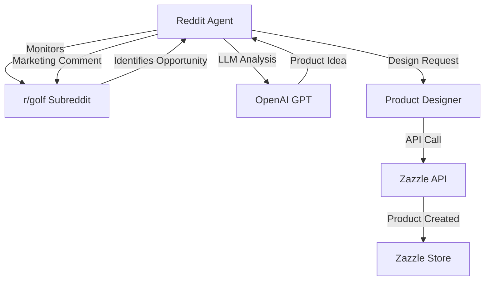

# Zazzle Dynamic Product Generator

This project automates the process of dynamically generating products on Zazzle based on Reddit interactions. The system uses the Zazzle Create a Product API to create new products in real-time, focusing on custom stickers as the initial product type.

## System Components

### 1. Reddit Agent
- Monitors and interacts with r/golf subreddit
- Uses LLM to analyze posts and comments for product opportunities
- Generates engaging and marketing-focused comments
- Makes voting decisions based on content relevance
- Operates in test mode for safe development

### 2. Product Designer
- Receives design instructions from Reddit Agent
- Uses DTOs (Data Transfer Objects) for product configuration
- Integrates with Zazzle Create-a-Product API
- Manages product creation and listing
- Handles URL encoding for product parameters

### 3. Integration Layer
- Coordinates between Reddit Agent and Product Designer
- Manages API authentication and rate limiting
- Handles error recovery and retry logic
- Maintains system state and logging

## Workflow Diagram



## Features

- **Reddit Integration**: Automated monitoring and interaction with r/golf
- **LLM-Powered Analysis**: Dynamic product idea generation using OpenAI GPT
- **Product Generation**: Dynamic sticker design creation with configurable image generation models (DALL-E 2 and DALL-E 3)
- **Marketing Automation**: Context-aware comment generation
- **Test Mode**: Safe development environment with dry-run capabilities
- **Comprehensive Testing**: Unit, integration, and end-to-end test coverage with dedicated test output directory
- **DTO-Based Configuration**: Type-safe product configuration using Python DTOs

## Prerequisites

- Python 3.8+
- Zazzle API credentials
- Reddit API credentials
- OpenAI API key

## Environment Variables

Create a `.env` file in the project root with the following variables:

```
ZAZZLE_AFFILIATE_ID=your_zazzle_affiliate_id
REDDIT_CLIENT_ID=your_reddit_client_id
REDDIT_CLIENT_SECRET=your_reddit_client_secret
REDDIT_USERNAME=your_reddit_username
REDDIT_PASSWORD=your_reddit_password
OPENAI_API_KEY=your_openai_api_key
```

## Development

This project uses a Makefile to simplify common development tasks:

```bash
make venv      # Create Python virtual environment
make install   # Install dependencies
make test      # Run test suite
make run       # Run the app locally
make run-full  # Run the complete end-to-end pipeline
make clean     # Clean up development artifacts
```

### Example Commands

Run the full pipeline with DALL-E 2 (default):
```bash
make run
```

Run the full pipeline with DALL-E 3:
```bash
make run MODEL=dall-e-3
```

Generate an image with a custom prompt using DALL-E 2 (default):
```bash
make run-generate-image IMAGE_PROMPT="A cat playing chess" MODEL=dall-e-2
```

Generate an image with a custom prompt using DALL-E 3:
```bash
make run-generate-image IMAGE_PROMPT="A cat playing chess" MODEL=dall-e-3
```

### Command Line Options

The application supports different modes of operation:

```bash
# Run the full end-to-end pipeline
python main.py full

# Test Reddit agent's voting behavior
python main.py test-voting
python main.py test-voting-comment

# Test comment generation
python main.py test-post-comment
python main.py test-engaging-comment
python main.py test-marketing-comment
python main.py test-marketing-comment-reply
```

## Testing

The project includes comprehensive test coverage:

```bash
# Run all tests
make test

# Run specific test files
python -m pytest tests/test_reddit_agent.py
python -m pytest tests/test_product_designer.py
python -m pytest tests/test_integration.py
```

### Test Categories

- **Unit Tests**: Individual component testing
- **Integration Tests**: Component interaction testing
- **End-to-End Tests**: Complete pipeline testing
- **Reddit Agent Tests**: Voting and interaction pattern testing
- **Product Designer Tests**: URL encoding and parameter handling
- **Image Generation Tests**: Tests for both DALL-E 2 and DALL-E 3 models

### Test Output Directory

Test outputs, including generated images and product data, are stored in a dedicated `test_output` directory. This ensures that test artifacts are properly isolated and managed.

## License

MIT 

## Zazzle Product Designer Agent

The Zazzle Product Designer Agent is responsible for generating custom products on Zazzle based on instructions received from the Reddit agent. This agent utilizes the Zazzle Create-a-Product API to design and create products dynamically.

### Initial Focus: Custom Stickers

The initial focus of the Product Designer Agent is on creating custom stickers. The agent will:

- Receive design instructions from the Reddit agent
- Use the Zazzle Create-a-Product API to generate custom sticker designs
- Ensure proper URL encoding of product parameters
- Handle dynamic text and color customization

### Integration with Reddit Agent

The Product Designer Agent works in conjunction with the Reddit agent to:

- Process LLM-generated product ideas
- Generate product designs based on the context and relevance of the conversation
- Create and list the products on Zazzle for potential sales

### Future Enhancements

In the future, the Product Designer Agent can be expanded to include other product types and design options, allowing for a broader range of custom products to be generated based on Reddit interactions.

## Reddit Agent Voting and Commenting

The Reddit agent can interact with posts and comments in several ways:

- **Voting**: Upvote and downvote both posts and comments
  - `test-voting`: Upvotes and downvotes a trending post in r/golf
  - `test-voting-comment`: Upvotes and downvotes a comment in a trending post, printing the comment text, author, link, and action taken for manual verification

- **Commenting**: Comment on posts (test mode only)
  - `test-post-comment`: Simulates commenting on a trending post, printing the proposed comment text, post details, and action for manual verification
  - In test mode, comments are not actually posted to Reddit, but the system shows what would be posted 

- **Marketing Commenting**: Reply to comments with marketing content (test mode only)
  - `test-marketing-comment-reply`: Simulates replying to a top-level comment in a trending post with a marketing message, printing the proposed reply text, product information, and action for manual verification. 