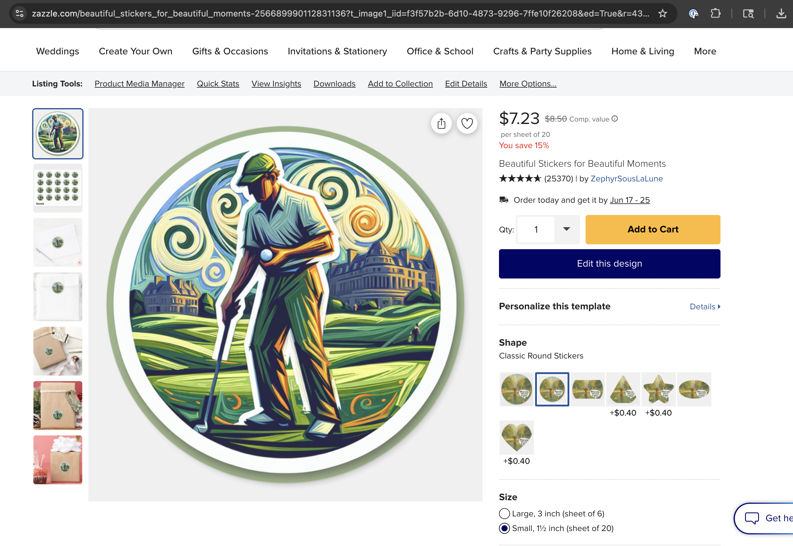

## June 13, 2025

### Progress Made Today

1. **Successful API Integration:**
   - The API integration has been successfully completed, with all endpoints functioning as expected.
   - The `/api/generated_products` endpoint is now returning the correct data, including product details and associated Reddit posts.

2. **Database Management:**
   - The `.coverage` file has been added to `.gitignore` to prevent it from being tracked in the repository.
   - The `.coverage` file has been removed from Git tracking while keeping it locally.

3. **Pipeline Execution:**
   - The full pipeline was executed successfully, generating a product based on a trending Reddit post.
   - The pipeline run included:
     - Finding a trending post: "Shane Lowry picks up his ball without marking it"
     - Generating a product idea with the theme "Capturing the Happenstance"
     - Creating an image using DALL-E and uploading it to Imgur
     - Generating a Zazzle product URL with an affiliate link

4. **Testing:**
   - All tests have been run successfully, with 204 tests passing and 1 skipped.
   - The overall test coverage is 75%, with some areas still needing improvement.

### End-to-End Run Summary

- **Pipeline Run ID:** 6
- **Reddit Post ID:** 1lascnz
- **Product Theme:** Capturing the Happenstance
- **Image Description:** A simplified, stylized illustration of Shane Lowry on a vibrant green golf course, unwittingly picking up his ball without marking it. The background features a hint of the iconic Oakmont clubhouse architecture. There are abstract swirls surrounding him, conveying the sense of chaos or delirium described in the post.
- **Image URL:** [https://i.imgur.com/ZnKClTj.png](https://i.imgur.com/ZnKClTj.png)
- **Zazzle Product URL:** [https://www.zazzle.com/api/create/at-238627313417608652?ax=linkover&pd=256689990112831136&fwd=productpage&ed=true&t_image1_url=https%3A//i.imgur.com/ZnKClTj.png&tc=RedditStickerz_0](https://www.zazzle.com/api/create/at-238627313417608652?ax=linkover&pd=256689990112831136&fwd=productpage&ed=true&t_image1_url=https%3A//i.imgur.com/ZnKClTj.png&tc=RedditStickerz_0)

### Screenshot

 